# Versions Web de quelques _Jeux de réflexion_
[In English](./README.html)

Cette page donne accès aux fichiers sources de versions web de jeux de réflexion pour une personne publiés par [Smart Games](https://en.wikipedia.org/wiki/SmartGames) ou [Think Fun](https://en.wikipedia.org/wiki/ThinkFun). Ces jeux présentent une situation avec des pièces qu'il faut placer ou glisser sur le plateau afin d'atteindre une situation _gagnante_. Les situations de départ sont classées par niveau de difficulté pour atteindre la situation finale.

J'ai toujours été un amateur de ce type de jeu sous forme physique. Pour quelques-uns d'entre eux, j'en avais développé des versions Java, dont certaines ont servi pour des travaux pratiques dans des cours de programmation que je donnais.

Dans toutes ces versions informatiques, le programme permet de trouver une solution utilisant le nombre minimum de coups. Cette solution est obtenue par une exploration systématique _en largeur_ (breadth-first search) de toutes les situations possibles. Ces solutions sont obtenues en quelques secondes, même pour les situations les plus difficiles. Ceci pourrait être vu comme un peu _décourageant_, mais le but est de s'amuser.

J'ai décidé de reprogrammer certains de ces jeux pour pouvoir les jouer dans un navigateur internet sur ordinateur ou téléphone. Le codage est effectué en JavaScript, tandis que l’affichage est assuré par SVG, ce qui permet une adaptation dynamique à la taille de l’écran\. Ces jeux partagent un ensemble de fonctions et classes afin d'uniformiser leur utilisation et leur programmation.

**Attention**: Ces jeux ont surtout été testés sur un écran d'ordinateur, leur comportement n'est pas garanti sur un téléphone ou une tablette lorsqu'il faut _glisser_ des pièces pour les déplacer plutôt que d'appuyer sur une flèche.
Voici les jeux actuellement disponibles en ordre alphabétique de leur nom en anglais, qui correspond à l'ordre d'affichage des répertoires:

# Jeux disponibles

|     | Lien pour jouer | But du jeu |
| --- | --- | --- |
| 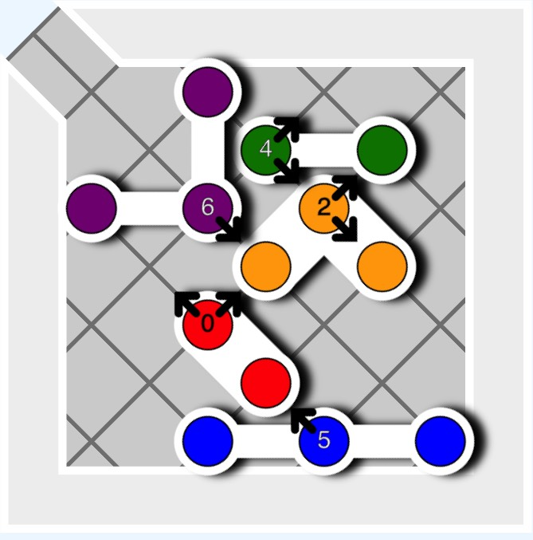 | [Anti-Virus](./AntiVirus/AntiVirus.html) | Faire sortir le virus rouge |
| 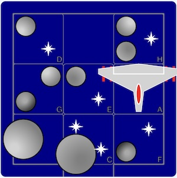 | [Alerte Astéroïdes](./AsteroidEscape/AsteroidEscape.html) | Sortir le vaisseau sans frapper d'astéroïde |
| 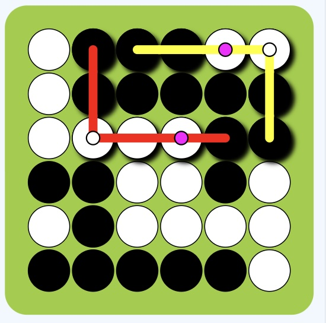 | [Bend It](./BendIt/BendIt.html) | Plier et placer les pièces  |
| 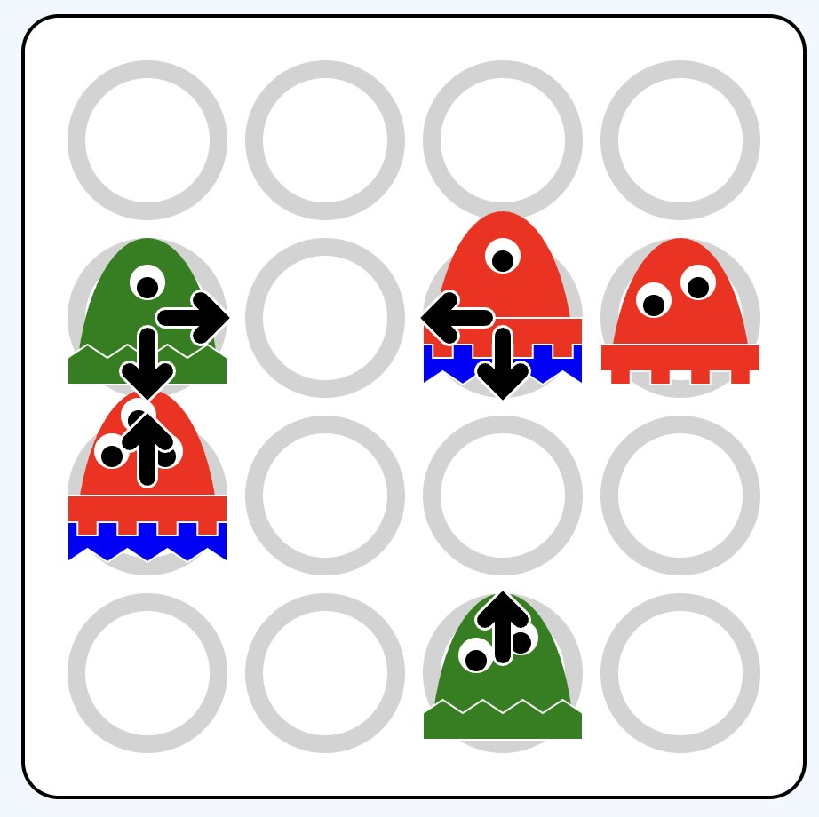 | [Cannibal Monsters](./CannibalMonsters/CannibalMonsters.html) | Empiler tous les monstres |
| 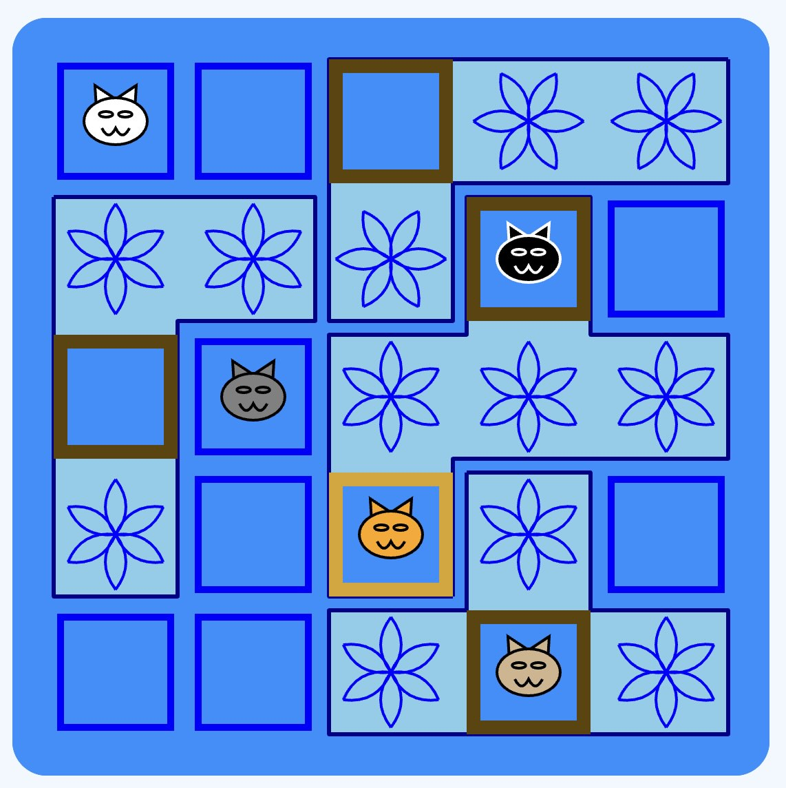 | [Chats tournent en rond](./CatsNBoxes/CatsNBoxes.html) | Placer les chats dans les boites |
| 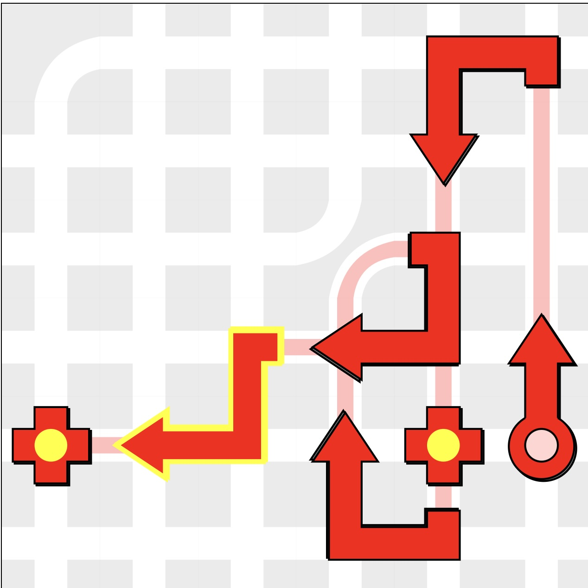 | City Maze   [Express Delivery](./CityMaze/CityMaze_Express_Delivery.html)   [On the Double](./CityMaze/CityMaze_On_the_Double.html) | Construire un chemin pour atteindre toutes les cibles |
| 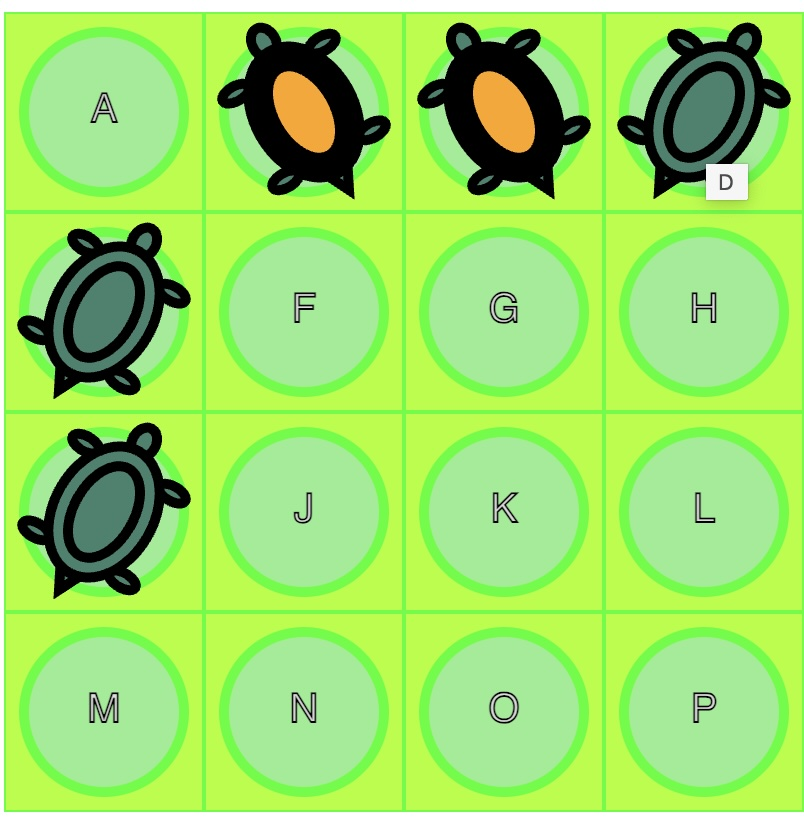 | [Flip It](./FlipIt/FlipIt.html) | Tourner toutes les tortues |
| 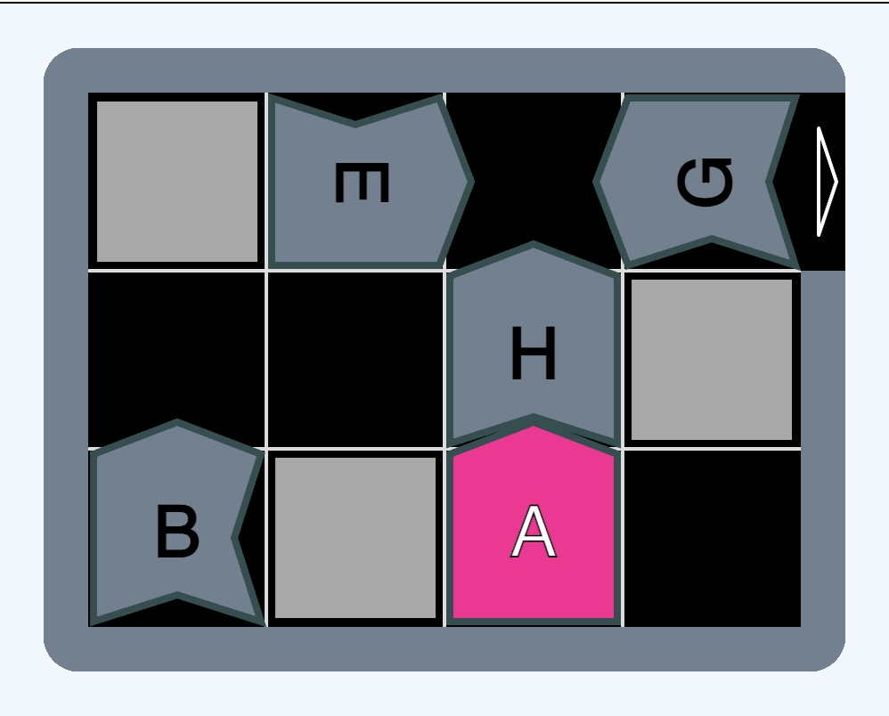 | [Tombe Frayeur](./GraveYardShift/GraveYardShift.html) | Sortir la pièce rose en n'accrochant pas les autres |
| 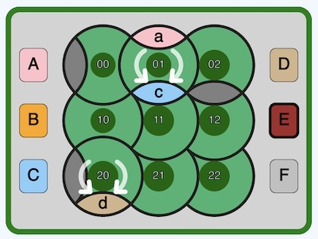 | [Parc'ours en forêt](./GrizzlyGears/GrizzlyGears.html) | Amener chaque pièce devant sa cible en tournant des disques |
| 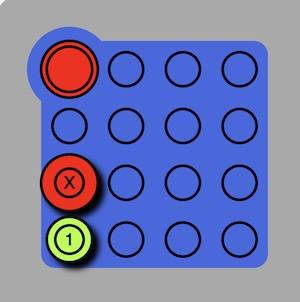 | [Hot Spot](./HotSpot/HotSpot.html) | Amener le jeton rouge en haut à gauche |
| 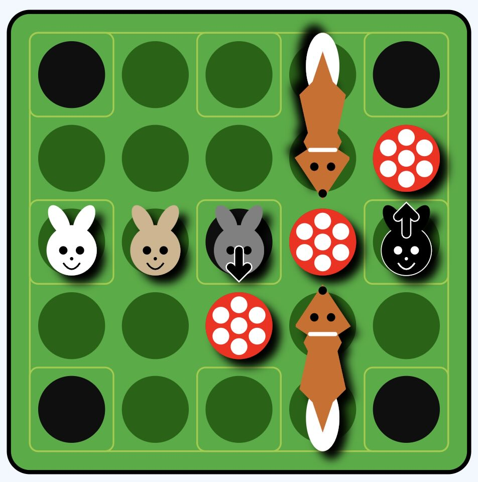 | [Jump In](./JumpIn/JumpIn.html) | Faire sauter les lapins dans les terriers |
| 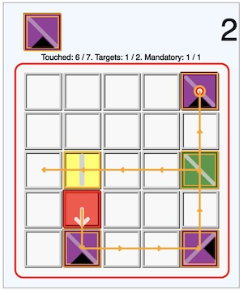 | [Laser Maze](./LaserMaze/LaserMaze.html) | Tourner toutes les tortues |
| 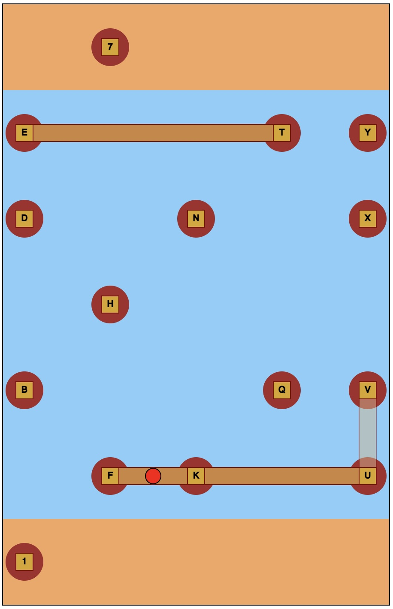 | [River Crossing](./RiverCrossing/RiverCrossing.html) | Faire traverser la rivière au randonneur |
| 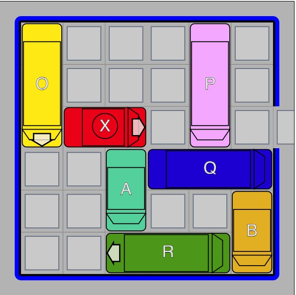 | [Rush Hour](./RushHour/RushHour.html) | Faire sortir la voiture rouge |
| 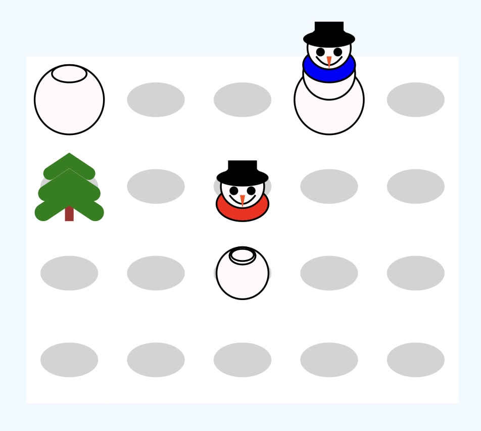 | [Je voudrais un bonhomme de neige](./SnowProblem/SnowProblem.html) | Monter des bonhommes de neige en faisant rouler des boules |
| 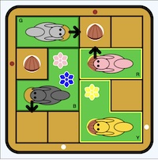 | [Cache Noisettes](./SquirrelsGoNuts/SquirrelsGoNuts.html) | Déplacer les écureuils pour qu'ils cachent leur noisette dans un des trous. |
| 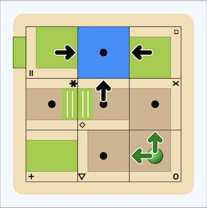 | [Tipover](./TempleTrap/TempleTrap.html) | Sortir l'aventurier en glissant des pièces du labyrinthe |
| 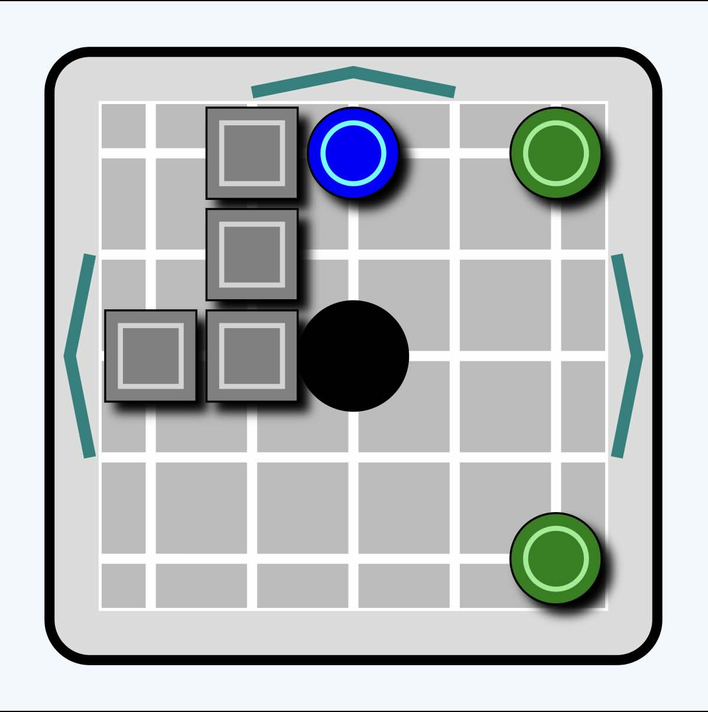 | [Tilt](./Tilt/Tilt.html) | Faire entrer les boutons verts dans le trou du milieu en _penchant_ le jeu |
| 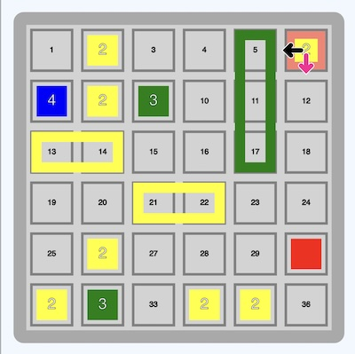 | [Tipover](./TipOver/TipOver.html) | Amener le _culbuteur_ sur la caisse rouge |
| 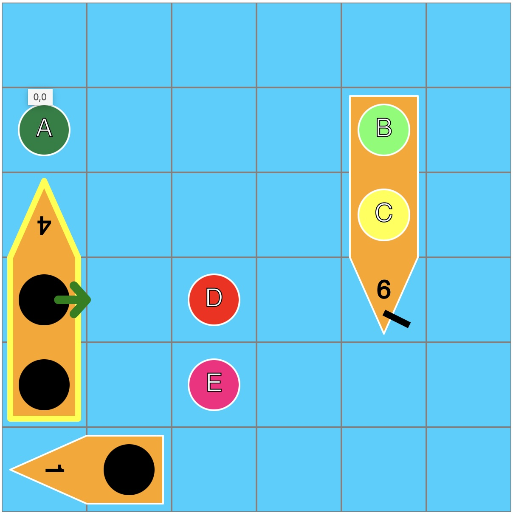 | [Titanic](./Titanic/Titanic.html) | Embarquer les naufragés dans les bateaux |
| 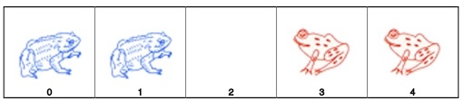 | [Toads and Frogs](./ToadsNFrogs.html) | Interchanger les grenouilles et les crapauds |

# Autres documents
* [Explication (en anglais) de l'organisation des programmes](./Organization.html)
* [Page web pour aider à la mise au point d'expression `path` de SVG.](./SVG_Path_Playground/SVG_PP.html) 
* [Script d'initialisation pour initialiser un nouveau jeu](./buildFromTemplate.js)
  * [Répertoire de modèles pour initialiser un nouveau jeu](./Template)
* Fichiers JavaScript
  * [Fonctions de création de SVG et pour l'interaction](./SVGtools.js)
  * [Fonctions pour la résolution automatique des jeux](./Solver.js)
  * [Fonctions de gestion de l'interface commune](./Main.js)
  * *super*classes pour chaque jeu
    * [Gestion de la planche de jeu](./Board.js)
    * [Affichage du jeu](./Display.js)
    * [Gestion de la grille du jeu](./Grid.js)
    * [Information conservée pour chaque coup](./Jumps.js)
    * [Information sur chaque pièce](./Piece.js)
* Fichiers auxiliaires
  * [Organisation globale de la page web](./body.html)
  * [Feuille de style](./Common.css)
  * [Coordonnée i,j](./C.js)
  * [Lancer toutes les résolutions en lot](./Test_batch_all.zsh)
  * [Lancer toutes les exécutions dans un navigateur](./test_html_all.zsh)

[Guy Lapalme](mailto:lapalme@iro.umontreal.ca)