<center style="font-size:3em; font-family: 'Open Sans'; font-weight: bold"> Development of web versions of single-player puzzles 
</center>


<center><a href="mailto:lapalme@iro.umontreal.ca">Guy Lapalme</a><br/>RALI-DIRO<br/>Université de Montréal<br/>August 2026</center>

This document explains the underlying principles of web versions of some single-player puzzle games published by [Smart Games](https://en.wikipedia.org/wiki/SmartGames) or [Think Fun](https://en.wikipedia.org/wiki/ThinkFun). These games present a situation with pieces that must be placed or slid on a rectangular board in order to achieve a *winning* situation. The starting situations are classified by level of difficulty to reach the final situation.

I have always been a fan of this type of game in physical form. For a few of them, I once developed Java versions, some of which have been used for practical exercises in programming courses I taught.

These computer versions have the ability to discover a solution using the least possible number of moves or pieces. It does this by systematically exploring all possible game states using a breadth-first search. These solutions are found in a matter of seconds, often milliseconds, even in the most complex scenarios, which can sometimes be a bit *discouraging*, considering that many minutes are often needed to solve it *manually*.

I recently decided to rewrite some of these games to be played in a web browser, either on a computer or a phone. The code is written in JavaScript, and the graphics are displayed using SVG, allowing them to adapt automatically to the screen size.

Games can be categorized according to the fact that:

- All pieces are initially on the board, the moves being either or both

  - **Jumping** : a piece can jump over one for more other pieces   

  - **Sliding**:  slide them into a *winning* configuration. 

  Movement constraints must be taken into account, such as no overlap between pieces and the specific moves allowed by each piece.  In some games, pieces can disappear or change their appearance and behaviour.

- None or only a few pieces are initially on the board, the others being in a reserve 

  - **Placing**: find the place and orientation of pieces on the board 

In some games, **pieces can change** during the game, either by stacking over others or by flipping. The allowed movements can then change.

<center>Table 1: Twenty-one games that are available in this directory: typical configuration, link to an <i>official description</i>,  goal and characteristics.<br/> 
  <b>J</b>: jumping, <b>S</b>:sliding, <b>P</b>:placing, <b>CP</b>: changing pieces</center>

|                                                              | Name                                                         | Goal                                                      | J | S | P | CP |
| ------------------------------------------------------------ | ------------------------------------------------------------ | --------------------------------------------------------- | - | - | - | -- |
|  | [HotSpot](https://theplayfulotter.blogspot.com/2018/08/hotspot.html) | Make the red circle jump to the top left spot             | ✓ |   |   |    |
|         | [Rush Hour](https://www.ravensburger.us/en-US/products/games/thinkfun/rush-hour-76582) | Exit the red car                |   | ✓ |   |    |
|        | [Anti-Virus](https://www.smartgames.eu/uk/one-player-games/anti-virus) | Exit the red *virus*                            |   | ✓ |   |    |
|  | [Asteroid Escape](https://www.smartgames.eu/uk/one-player-games/asteroid-escape-0) | Exit the plane avoiding asteroids    |   | ✓ |   |    |
|  | [Graveyard Shift](https://www.smartgamesandpuzzles.com/graveyard-shift.html) | Exit the pink piece by sliding pieces.     |   | ✓ |   |    |
|  | [GrizzlyGears](https://www.smartgames.eu/uk/one-player-games/grizzly-gears) | Move boats by rotating disks                  |   | ✓ |   |    |
|  | [Jump In](https://www.smartgames.eu/uk/one-player-games/jump) | Make the rabbits find their hole                                 | ✓ | ✓ |   |    |
|  | [Toads and Frogs](https://en.wikipedia.org/wiki/Toads_and_Frogs) | Exchange positions of toads and frogs                     | ✓ | ✓ |   |    |
|  | [TempleTrap](https://www.smartgames.eu/uk/one-player-games/temple-trap-0) | Exit the adventurer by sliding labyrinth pieces   | ✓ | ✓ |   |    |
|  | [River Crossing](https://www.think-fun.be/fr/products/river-crossing/) | Make a hiker traverse the river                   |   | ✓ | ✓ |    |
|           | [Flip It](https://trictrac.net/jeu-de-societe/flip-it)       | Flip all turtles                                          | ✓ |   |   | ✓  |
|      | [Snow Problem](https://www.smartgames.eu/uk/one-player-games/snow-problem) | Build snowmen by rolling balls              |   | ✓ |   | ✓  |
|          | [Titanic](https://www.smartgamesandpuzzles.com/titanic.html) | Board all shipwrecked people                              |   | ✓ |   | ✓  |
|             | Tilt                                                         | Push green button in the hole by tilting the board        |   | ✓ |   | ✓  |
|   | [Squirrel Go Nuts](https://www.smartgames.eu/uk/one-player-games/squirrels-go-nuts) | Make all squirrels hide their nut  |   | ✓ |   | ✓  |
| | [Laser Maze](https://www.ravensburger.us/en-US/products/games/thinkfun/laser-maze-44001014#) |Laser touch pieces and hit targets |   |   | ✓ | ✓  |
|         | [City Maze](https://www.smartgamesandpuzzles.com/city-maze.html) | Build a path to reach all  targets                    |   |   | ✓ | ✓  |
|  | [Cats & Boxes](https://www.smartgames.eu/uk/one-player-games/cats-boxes) | Put all the cats in the boxes                      |   |   | ✓ | ✓  |
|  | [BendIt](https://www.smartgamesandpuzzles.com/bend-it.html) | Bend pieces so that they can all be placed on the board             |   |   | ✓ | ✓  |
|  | [Cannibal Monsters](https://www.smartgamesandpuzzles.com/cannibal-monsters.html) | Stack monsters until only one is left| ✓ | ✓ |   | ✓  |
|  | [TipOver](https://www.fatbraintoys.com/toy_companies/thinkfun/tipover.cfm) | Move a tipper across piles of crates                |   | ✓ | ✓ | ✓  |

Some détails about these games:

- **Jumping**:
  - *Hot Spot*: pieces must jump over other but bigger pieces cannot land one besides another
- **Sliding**:
  - *Rush Hour*: the movements of pieces depend on the positions of others. In certain arrangements, there are two vehicles to leave, so when the first one departs, it is removed from the board.
  - *Anti-Virus*: pieces are positioned on the intersections of the lines of the grid. The board is tilted, and the pieces are tangled, meaning that moving one piece can also affect others. 
  - *Asteroid Escape*:  as some pieces overlap on positions of other pieces, they can interfere with their movements.
  - *Graveyard Shift*: pieces of different polygonal shapes slide but as other pieces outstretch on the exterior, so they  can block the movement of other pieces. 
  - *Grizzly Gears* : pieces (boats) are displaced by rotating disks whose positions might interfere with surrounding pieces. Although the movements seem limited, the right moves are often counterintuitive. The movements in this game are quite different from the usual sliding or placing, because pieces slide when other pieces are rotated. It was quite challenging to cast this game in the framework we had defined, but we finally found a way. The display for this game was also more difficult to develop because of the rotating pieces.
- **Jumping, Sliding**:
  - *Jump In*: in this game, only the position of pieces changes
  - *Toads and Frogs:*  pieces can slide one space or jump over another one
  - *Temple Trap:* pieces can slide to a neighboring position, but a piece cannot be moved when the adventurer is on it. The adventurer can only move to pieces that are accessible, i.e., not crossing a wall or on the same floor.
- **Sliding,Placing** :
  - *River Crossing*: a plank can be removed and placed elsewhere on an adjacent plank, so it can overlap its previous position.
- **Jumping, Changing pieces**:
  - *Flip It* : each piece can be in two states that are flipped when another piece jumps over it.
- **Sliding, Changing pieces:**
  - *Snow Problem*: some pieces can be put on top of others and thus removed from the board.
  - *Titanic*:  the shipwrecked  people (shown as circles) can be put on the boats, so they are removed from the board. The ship is thus modified as are the allowed moves because the boat cannot move when it is *full* which limits the movements of other boats.
  - *Tilt*:  send the green buttons into the central *black hole,* which makes them disappear, while avoiding sliding a blue button in the hole., As pieces are moved by tilting the board,  many pieces can change place in a single jump.
  - *Squirrel Go Nuts*: the goal is to slide squirrels with nuts over holes in which the nut will fall. Both the board and some pieces can change their state during the game.
- **Placing, Changing pieces**:
  - *Laser Maze*:  place a laser, mirrors and targets on the board so that the laser reflects on all pieces while hitting a given number of targets. Some selected pieces in a given configuration can be moved or rotated. 
  - *City Maze*: the pieces are not all given in the starting configuration. The player must select some pieces and place them on the board with the right orientation in order to form a path from a starting arrow and going to all final crosses. Since the pieces have a red or blue side, a variant of this game allows for paths of different colors. 
  - *Cats & Boxes*: a piece must be removed before being placed elsewhere, so in a way it can overlap its previous positions, but not another piece.
  - *Bend It*:  piece can change their orientation and form by rotating some parts, possibly by rotating in 3D.

- **Jumping, Sliding, Changing pieces**:
  - *Cannibal Monsters*: monsters can eat others if their base correspond strictly, so pieces evolve over time.

- **Sliding, Placing, Changing pieces:**
  - *TipOver* : a piece is a crate of a certain height which, when tripped, lies on the board and it stays as is for the rest of the game.

Most of these games are already available in electronic form. They can be downloaded from a website, or from a smartphone app store. Their graphics are usually much more sophisticated than mine. My primary objective in crafting this document is pedagogical, aiming to structure the common functions and classes among these games. I also chose games that have different features for pieces and their movements. Writing this document has been very useful in helping me clarify my thoughts.

# Characteristics of These Games

In the following we use the following naming conventions:

- **board**: a rectangular *grid* with *M* rows and *N* columns\. In some games, some positions of the board have a special role. For example, in Tilt, Anti-Virus or Rsh Hour, reaching a certain position indicates a winning situation.
- **piece**: an element of the game that can be placed on the board; it has a **position**: *i,j*,  row and column numbers starting from 0.  In some games, a piece can have an **orientation** identified either by a cardinal point or an arrow. In some games, pieces have other characteristics, such as being *flipped* or *stacked*  over other pieces.
- **reserve**: a section of the board in which pieces can be kept before being placed on the board. 
- **display**: a screen representation of the board;
- **configuration**: encoding of the position and orientation of the pieces at the start of the game in a form that is easy to input from the game booklet.  
- **state**: encoding of the position and orientation of each piece during the game; a state must be able to represent all possible game situations while being efficient to be encoded and decoded during the game. 
  - The *initial* state is obtained from the configuration. 

  - A *winning* state is a *configuration* identified as the goal of the game. 
- **jump** : an action where a piece changes its position, possibly affecting other pieces on the board. Placing a piece to a position with an orientation can be thought of as a jump from the reserve to the board in the correct position. A jump keeps track of the previous jumps so the jumps leading to a winning state can be shown or to make it possible to undo previous jumps.
- **move** : a series of consecutive jumps performed by the same piece.  

The starting state determines the initial position of pieces on the board. The goal of the game is to determine the jumps of the pieces around on the board according to a set of rules until they form a *winning* state. A *solution* is, therefore, a list of *jumps* that can  go from the initial state to the desired winning state.

These games come with a booklet of starting configurations, classified by level of difficulty, to achieve a winning configuration. Often, there are many ways to solve a puzzle. The booklet shows one solution with the fewest number of moves or jumps. 

Each game presents its own set of challenges, which is all part of the fun. 

The computer version of these games has several advantages, including the following:

- The constraints of each game are systematically enforced, while it can happen that a player with a physical board sometimes forgets a side effect of a move or performs an illegal move. 
- For sliding  games, the allowed moves are displayed at each step from which the player chooses one. This is helpful in not forgetting allowed moves, so in a way it simplifies the game because it shows all possibilities while a player might miss a possibility with a physical board.
- It is very easy to *undo* the moves and even restart a configuration, while this is error-prone or inconvenient with the physical board.
- It is less noisy and annoying for other people in the room who do not play (e.g., my wife)!
- The system can compute and display a solution very fast, which can also be a bit intimidating at times.

The disadvantage is that players do not get physical feedback from the pieces. Also, the game increases screen time on the computer or phone. 

After developing several of these games, I noticed that they have many commonalities. Therefore, I developed a framework that describes generalizable processes that were applied across different games. This document uses *Flip It* as an example because it is relatively straightforward, but it also highlights some intriguing challenges. 

When tackling a new game, I suggest to start by developing an algorithm to determine the jumps from the starting state to a winning state without a graphical user interface. This *compels* to define the notation for the states, the allowed moves, the state changes after a move and the process to find a solution. Once that is done, this algorithm can be embedded into the graphical framework we have established. This process is further explained in section [4.1](#steps-for-building-a-new-game).

# Searching for a Solution

The goal of each game is finding a set of jumps between a starting state to a winning one. This sequence of jumps can be discovered using traditional AI search algorithms. Specifically, these games are single-player with complete information and full transparency. Given that the number of possible jumps  at each stage is limited, a breadth-first search approach ensures finding the shortest possible path to a solution in the minimum number of jumps or proving that no such a path exists.

We first describe how this search is implemented using  *Flip It* as an example, as its state description is straightforward. However, the search algorithm remains the same for other games.

*Flip It* is a variation of the classic Solitaire game played on a 4 × 4 grid, as illustrated in the top row of Table 2. Each space is designated by a letter, and the initial setup depicts turtles resting with their orange bellies facing upward (as seen in the first image). The letter associated with each grid cell can be inferred based on its surroundings or by hovering your cursor over the turtle, revealing its position. The goal is to find a series of jumps to turn them all onto their belly.  A turtle flips onto its belly or back when another jumps over it. The jumping turtle is not flipped. A turtle can only jump over one or two other turtles located on the same row, column, or diagonal. 

The second picture shows when the turtle in A jumped to C, flipping the turtle in B and then to K, flipping G, these consecutive jumps with the same piece are called a move\. The two following jumps flip the turtles in K and F giving rise to a situation where all turtles are belly up, thus forming a winning situation. Note that, in the third picture, a different winning situation could have arisen if K had moved to A.

<table>
    <tr>
        <td>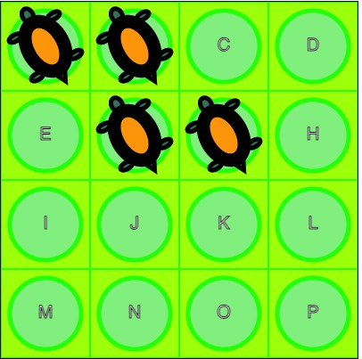</td>
        <td>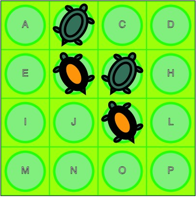</td>
        <td>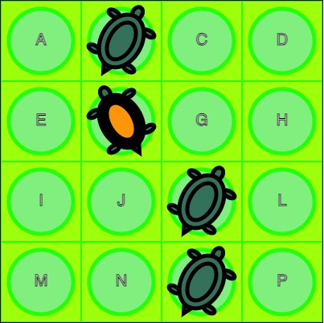</td>
        <td>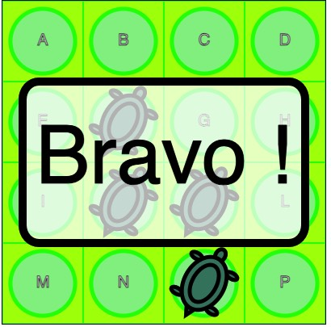</td>
    </tr>
    <tr>
        <td>Initial state</td>
        <td>Move A-CK</td>
        <td>Jump G-O</td>
        <td>Jump B-J - Win!</td>
    </tr>
    <tr>
        <td>ABFG</td>
        <td>bFgK</td>
        <td>bFko</td>
        <td>bfko</td>
    </tr>
    <tr>
        <td>A-C,A-K,B-J,B-L,F-H,G-E</td>
        <td>B-J,B-L,F-H,G-E,G-O,K-A</td>
        <td>B-J,F-P,K-A,O-G</td>
        <td></td>
    </tr>
    <caption>Table 2: Initial state, followed by a move and a jump to get to a <i>winning</i> state  in <i>Flip It</i>. 
The third line shows the state string that encodes it.
The last line shows the list of possible jumps at each state.</caption>
</table>


## Definition of a State

In this type of puzzle, a state is defined by the *position* of each piece on the board given by its row and column indices; a piece can also be in a given state such as its orientation or stacking other pieces.  To prevent endless loops, it is crucial to efficiently mark explored states. This can be accomplished by encoding the state in a way that makes it simple and quick to determine whether a position has already been visited or needs to be explored in the future.

In JavaScript, one can achieve this using either a `Set` or a `Map` data structure, with a string as the key. For *Flip It*, we opted for the encoding displayed in the third row of Table 2. Only the positions that have a turtle are specified, using the corresponding letter; when the turtle is on its back, we use the corresponding lowercase character. Certainly, we could have opted for a more compact encoding, where each position has just three states: empty, belly or back. With 2 bits for 16 positions, we could have used 32 bits. However, for development convenience, we chose to use a more descriptive string for each position.

For more complex state definitions, we merely *stringify* the JSON encoding of the state and use this string as  a key in the *Set* or *Map*.

## Definition of Configurations

Each game comes with a booklet that contains a numbered list of interesting configurations, organized into levels by the game designer. The content of the booklet must be converted into a computer-readable format that serves as an initial state. For *Flip I*t we use only the letter corresponding to a cell with a turtle. Therefore, the problem description is in the same format as the initial state, but this is not always the case. For example, for *Titanic*, the input format was chosen to be easy to enter. Unfortunately, it did not allow for encoding all possible states, including those involving boats carrying passengers, as will be discussed in the next subsection. 

A JavaScript file contains a list of levels, each with its unique attributes, along with an object that maps problem numbers to their respective initial input states. 

This file also contains validation code for input states. For *Flip It* this consists of a string containing between three and fifteen uppercase letters from A to P, with no duplicates. Problem strings can also serve as starting states, so the conversion from the input to a starting state is only a name change in the export directive.

```json
export {levels, problems as startStates}
const levels =[{"en":"Beginner","fr":"Débutant","from":1,"to":10},
               {"en":"Intermediate","fr":"Intermédiaire","from":11,"to":20},
               {"en":"Advanced","fr":"Avancé","from":21,"to":30},
               {"en":"Expert","fr":"Expert","from":31,"to":40}];

const problems = {
      1:"ABH",
      ...
      40:"ABCDEFGHIJLMNOP"
   }

// validate problems and convert them to start states
```

## Conversion from a problem to a starting state

For most games, the configuration must be encoded in a state that can be easily parsed, as this operation is done at each step of the solving process. 

The second column of Table 3 shows the input string corresponding to the problem shown in the *Titanic* booklet as in the first column . The direction of each boat is indicated by an arrow followed by the number of the boat in a template literal enclosed in backticks. The passengers are represented by the corresponding letter, while empty spaces are represented by dashes. This is appropriate for a starting position without any passengers on the boat. However, a comprehensive state must accommodate boats carrying passengers and passengers aware of their current vessel. The third column displays the JSON representation associated with the initial position. We had previously created a simpler, ad hoc encoding  parsed with a regular expression. However, we discovered that the JSON encoding and decoding process is significantly more efficient at run-time. 

<center>Table 3: Input  format and the corresponding JSON encoding for <i>Titanic</i></center>

| 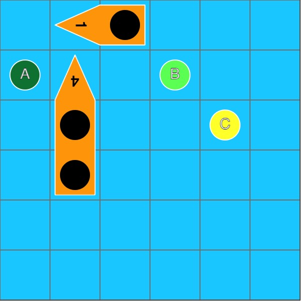 | 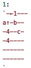 | 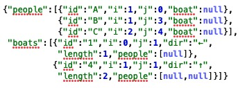 |
| :----------------------------------------------------------: | ------------------------------------------------------------ | ------------------------------------------------------------ |

The game of *Anti-Virus* presents an intriguing example of a transformed state. Due to the inclined board, the lines of the grid have varying lengths, making indexing slightly more complicated. However, for the initial position input, we use the *visible* portion of the grid. 

The initial cell on the first row of Table 4 displays a board that shows the coordinates of the intersections: a zero-based index for each row and a zero-based index from the left for each row. The adjacent cell shows the corresponding input notation for this problem: each piece is enclosed in square brackets, starting with the piece number, followed by the coordinates as zero-based line and column numbers from the top and left. The position of the *center* is given first, followed by the positions of the other dots. 

The left cell of the second line of Table 4 shows how the *visible lo*zenge is embedded in a rectangular grid of 8 lines of 7 cells each. Unused positions are shown with a dot and empty positions with an underline. This grid numbering is used to encode states in JSON with embedded lists. The right cell of the second line shows an example. In it, the first sublist of a piece indicates the line and column numbers of its center. Other sublists are relative positions from this center. By using relative positions, moving a piece after a move becomes easier. Only the *center* needs to be translated, since the entire SVG is relocated due to its built-in relative translation capabilities.

<center>Table 4: Input format and internal representation for <i>Anti-Virus</i></center>

| 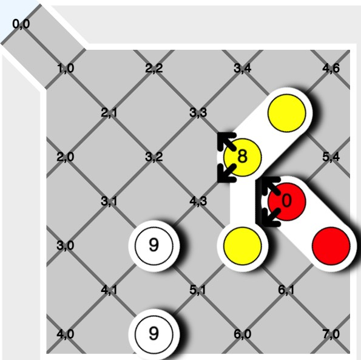 | 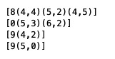 |
| :----------------------------------------------------------: | ------------------------------------------------------------ |
| 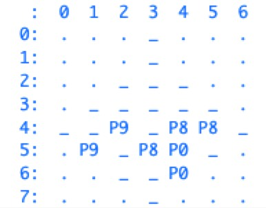 | 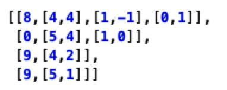 |


## Possible jumps for each piece

To begin, the set of all possible jumps for each state must be established. For *Flip It,* each turtle is examined to determine if it is adjacent to another turtle horizontally, vertically, or diagonally, and if it can jump over one or two other turtles. Table 2’s fourth row displays the potential jumps for the first three stages. Of course, in some games, jumps can be more intricate, such as not overlapping another piece or rotating or turning it over. 

As a breadth first search technique is used, it is usually a good heuristic to select the pieces with the least possible number of moves at each step. In that way, the search tree width is somewhat limited, but this can be counterproductive, in some cases, if the *wrong* piece and orientation are first tried.

After each jump, the game’s state must be updated to reflect where the piece has moved, as well as any potential side effects. In *Flip It*, this means *turning over* the turtles that were jumped. In some games, such as *Titanic* and *Squirrels Go Nuts*, a jump can change the piece (boarding people or losing a nut)  and the board (removing people from the sea or filling a hole) . But that effect is only taken into account if this move is chosen, but it should be computed when finding the possible moves.

For some games, possible move finding can be more involved. In particular, for placing games, such as *City Maze* or *Laser Maze*, in order to limit the number of possible moves, pieces from the reserve should not be tried everywhere on the board but only on free places along the path of the ray or the laser. Moreover, when there are similar pieces in the reserve, only one of each kind should be tried at a given step. For *Laser Maze*, at each step, we first pick the pieces from the reserve with the least number of orientations. 

Pieces in *Grizzly Gears* do not move but only rotate 90 degrees clockwise or anticlockwise, so it might be thought that determining the moves would be simple. But it revealed to be quite intricate because the irregular shape of one piece is often hindered by the orientation of its neighbours. The fact that the moving boat are shared between two rotating disks added a level of complexity.

For *Bend It*, pieces in the reserve can be bent in three ways at each end, rotated at four angles and turned to obtain a mirror images, before being placed on the board. In principle, when piece is placed on the board, there should always be a multiple of 6 places free in each closed region by other pieces. But for the moment, we ignore this constraint that we thought would be hard to implement. Exploring systematically all positions is fast enough anyway,

##  Exploring States

The following algorithm describes a *simili* JavaScript implementation of the systematic state exploration with a breadth-first search. It also tracks the transitions between configurations, starting at the current `state` represented as a string. This implementation uses the fact that a JavaScript `Map` maintains the insertion order of its elements during traversal, meaning that removing the *first* element is the *old*est’ one.

```javascript
done = new Set()  // set of seen configurations
to_do = new Map() // Map: key: configuration, value: the last jump
lastJump = null
to_do.set(state,last_jump)
while (to_do.size>0){
   [state,last_jump] = remove_first(to_do)
   current = new Board(config);
   allowed_jumps = current.allowed_jumps();
   reorder(allowed_jumps) // optional
   for (jump of allowed_jumps){
       current.play(jump)
       if (current.isComplete()) // exit as soon as a solution is found
          	return [current,jump.extend(lastJump)] 
       else { // save new state if it has not yet been seen or saved
            state_new = state.to_config();
            if (!done.has(state_new) && !to_do.has(state_new))
                to_do.set(state_new,jump.extend(lastJump))
       }
       current = new Board(config) // recover the initial state for this iteration
   }
}
return null // no solution found after having explored all states
```

This algorithm guarantees finding the solution with the fewest jumps, but not necessarily in the fewest moves. It does this by examining all states after n jumps before moving on to those after n+1 jumps, and stopping as soon as it finds a solution.

To maximize the number of consecutive jumps on a single piece, the permitted jumps (as outlined in line 9) are rearranged to prioritize exploring jumps that continue the previous jump with the same piece. This strategy is beneficial, but it still does not guarantee the fewest possible moves. 

The sequence of jumps can be inverted by tracing the links between each state. This reversed list is then consolidated, with consecutive jumps involving the same piece combined into single moves (as shown in the second column of the table). This approach displays the path to the solution.

This algorithm is very fast for *Flip It* and other games, taking only a few milliseconds on a MacBook Pro for most problems. However, a very difficult problem (the state `ABCDFGJKMNOP` with four empty spaces) took almost 10 minutes after more than 2 million iterations, leaving 1.7 million configurations unexplored for a solution in 11 jumps. We thus see that even a seemingly simple game can lead to many different states.

# Web application

Using a computer to solve a puzzle can be intriguing, but nothing beats the excitement of manually manipulating pieces on a digital screen or engaging in hands-on play with a tangible version. 

On the computer, however, the system can verify that only permitted moves are made, and it displays a message of congratulations upon encountering a winning situation. Sometimes, the system can discern that a solution is unattainable from a specific state. At the moment, it recognizes this scenario when no piece can move from that state. However, a piece may still be able to move, albeit only to a previous state. In theory, one could implement the algorithm from the previous section after each move to identify an insoluble case. We have chosen not to do so.  

The computer program’s convenience is that it allows for easy reversal of recent actions or restoration to the initial state. 

<figure>
<figcaption style="text-align:center">Figure 1: Graphical User Interface for <i>Flip It</i></figcaption>
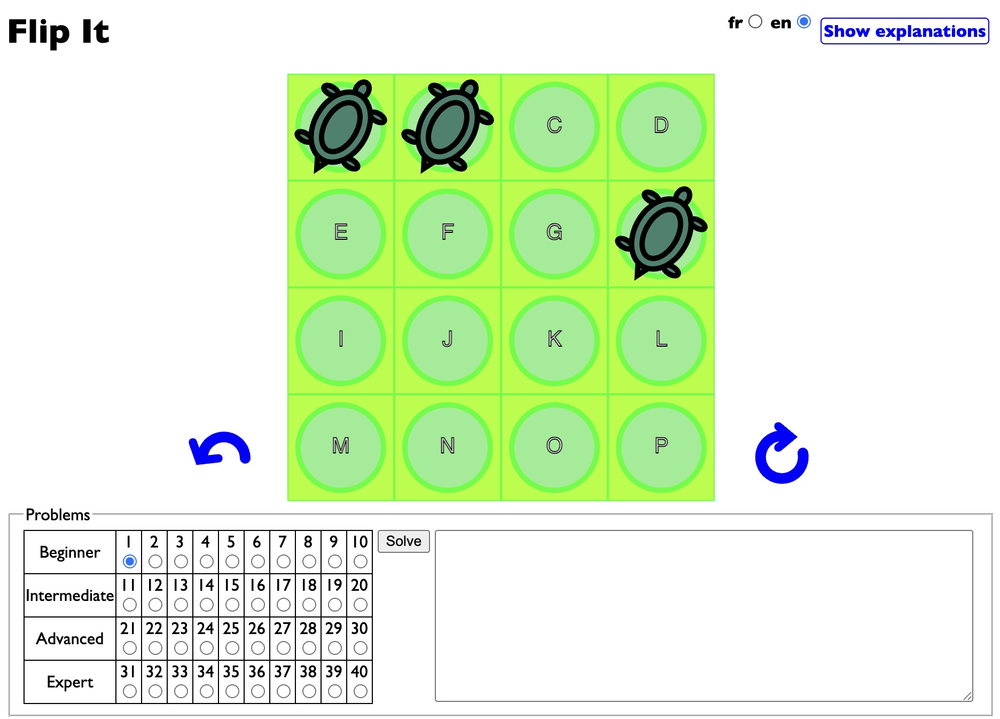
</figure>


The common screen layout for all games is described once again using *Flip It* (Figure 1). The center is for the board. Turtles are made to jump by dragging them into another position. If a turtle is moved to an unauthorized position, it returns to its initial spot. Additionally, if one turtle jumps over another, the latter is *flipped*.

The arrows on the board’s side are used to *undo* the previous jump (to the left) or *restart* the current problem (to the right). These buttons are hidden on a small screen, such as on a smartphone, so that the game display appears at the top.

The bottom left part of the board is used to select an initial configuration from a range of levels of difficulty. These correspond to the numbered configurations listed in the manual or physical game cards.

The lower right corner serves as a message area, where the system displays either the user’s jump sequences leading to a winning configuration, or a solution found upon clicking the `Solve` button. 

By clicking on the top-right corner, you will find explanations of the game’s rules and how to use the graphic interface. These instructions are available in both English and French.

Each game has its own distinctive method of moving pieces on the board, which sets it apart. For instance, in *Snow Problem* players roll a snowball by clicking on it, and when multiple directions are available, directional arrows appear so that the user can select a direction. In *Titanic* players can also navigate boats using the arrow keys on the keyboard. For River Crossing, clicking is used for either moving the hiker or for showing where a plank must be put.

 The fundamental principles of all games remain the same: a board, pieces, and a way to move them around. This is a classic example of the Model-View-Controller architecture, with the state serving as the model, the display as the view, and the mouse and keyboard as the controller.

## Graphic Element Representation

We chose SVG for graphics because SVG elements can be easily moved and rotated to match physical actions. Moreover, overlapping drawings simulate the board in the background with pieces of different shapes over it. Furthermore, these graphics can seamlessly adapt to any screen size, all while using a single internal coordinate system\.  

Transforming the screen pixel coordinates of a mouse click into SVG coordinates is more intricate\. It considers the global SVG element’s location on the screen, as well as its width and height, along with the view box’s dimensions\. 

A listener can be attached to each SVG element that can move\. This allows the specific element to be identified using the `currentTarget` field of the event when a mouse click occurs\. Since only valid moves are displayed as choices, there is no need to validate the jumps during the game\. 

Since several graphics in a game share a similar form, they can be described only once within a `defs` tag\. Subsequent `use` tags can then reference them in either the `background` or `pieces` sections\. This setup ensures that the pieces are displayed over the background representing the physical board because the graphic elements are displayed in document order\. 

```html
<svg viewBox="0 0 4 4" xmlns="http://www.w3.org/2000/svg" id="svg_element" width="400px">
    <defs id="defs"></defs>
    <g id="background"></g>
    <g id="pieces"></g>
</svg>
```

 *Anti-Virus*, shown in the second table of section 2.3, makes use of the power of SVG. It creates the board and pieces using absolute coordinates in an 8 × 7 grid that is rotated 45° within the view\. In addition, a *filter* that softens and shifts the drawings of the pieces creates a drop shadow effect that makes them stand out\. This filter effect is also used in other games\. Unfortunately, it is not compatible with the Safari browser, so it is not applied when the game is running in this browser\.

Creating SVG elements, a natural choice would have been *D3\. Howeve*r this library is geared towards data analysis and animation\.  Instead, we used *jQuery* because it makes it easy to manipulate HTML elements\. As SVG elements are in a specific name space, we used a function to create them with an object whose keys are the attribute names and values are their corresponding values\.

```javascript
function svg(tagName,attrs,...body){
    var $e = $(document.createElementNS('http://www.w3.org/2000/svg',tagName));
    if(arguments.length>1){
        $e.attr(attrs);
        if(body!=null)$e.append(body);
    }
    return $e;
}
```

The following subsection shows an example of invoking this function\.

### Board representation

The playing surface is an MxN grid of identical elements\. To facilitate drawing and position calculation, each position on the board is a square unit\. The `viewBox` attribute ensures that the system adjusts the graphics to the precise pixel coordinates\.  

The following code defines a single cell on the board that will be *used* 16 times in *Flip It*\. This cell consists of a rectangle covering the entire 1 by 1 square, and then draws a circle with a radius of 0\.4 and a center at 0\.5, 0\.5\. Because the color of the circle differs slightly from that of the rectangle, it recalls the colors of the original game\.   

```swift
svg("g",{id:"board-def"},
   svg("rect",{width:1,height:1, fill:"#AAFF00",stroke:"#00FF00","stroke-width":0.02}),
   svg("circle",{cx:0.5,cy:0.5,r:0.4,fill:"#90EE90", stroke:"#00FF00","stroke-width":0.05})
)
```

### Piece and Jump Representation 

Each illustration is created in a square unit for *Flip It\. In this instance*, we opted for a collection of ellipses of varying sizes to depict the turtle\. However, a more skilled graphic designer could undoubtedly create a more realistic version\. There is another very similar drawing for the *belly\-up* turtle\. In other games, a piece can be rotated to get to another state. In *Flip I*t all the pieces are identical and can move, but this is not always the case\. Other games feature different types of pieces, some of which cannot move\.

In some cases, pieces can occupy more than one cell. For example, the underlying grid of *CityMaze* is 18 by 18 and not 6 by 6, as would be expected just by looking at the board. This is necessary to take into account the possible shapes and orientations of arrows that can block the placement of others. For *AsteroidEscape*, each cell is divided in four, and some pieces, notably the plane, can span over the neighboring cells. Big stones can also block the movement of other pieces. 

Upon being clicked, an object can be moved by drag and drop by monitoring the cursor’s movement and adjusting its  coordinates accordingly\. However, before moving any piece, it must first be relocated to the end of the `pieces` array\. This is achieved effortlessly by *appending* this element at the end of the `pieces` array, which moves it to the end while removing it from its previous location in the HTML document. Drag and drop of pieces is used for games like *FlipIt*, *Hot Spot*, *City Maze* or *CatsNBoxes*.

But in other games, like *Cannibal Monsters*, *Antivirus*, *Rush Hour* or *Snow Problem*, pieces can only be moved horizontally or vertically on neighboring cells. In these cases, after we have computed all the possible moves for each piece, we display arrows only above those pieces that can be moved\. The arrows only indicate the permitted directions\. The user can thus only choose a valid move at each step. This greatly simplifies programming, as there is no need for jump validation. This might be considered as a simplification of the game, because it might show moves that could have been *forgotten* by the player. 

We explored a different method for *Titanic*: the player taps on a ship to activate it, and then the arrow keys on the keyboard are used to maneuver it. The user interface is more complex to code, but it feels natural when playing on a computer. However, it is not ideal for mobile devices without a keyboard. An alternative solution could be implementing drag-and-drop functionality.

In *Asteroid Escape* or *Temple Trap*, only the pieces adjacent to the hole can be moved\. Therefo*re*, there is no need for directional arrows, as clicking on a movable piece causes it to move in a single direction\. This simplifies the user interface but a way must be found to indicate that the user clicked on a piece that cannot be moved, we use *flashing* the piece.

*Tilt* is a very interesting case in which it is the board that is moved (tilted, in fact) which forces all pieces to slide in the tilting direction: it would be interesting to detect tilting on a phone or tablet, but for the moment we show the allowed moves with arrows displayed around the board.

The round shapes for the board, the disks and the boats of *Grizzly Gears* are quite different than the usual rectangles for other games. They were implemented using the circle and arcs of the SVG `path` commands. The fact that a boat can be *shared* between two disks added a level of complexity when determining the origin of its rotation.

For *Bend It*, pieces can change form and orientation but they can also be flipped horizontally or vertically. So a piece in the reserve must first be put in a  folding area where it can be manipulated before being places on the board, The user interface for these manipulation proved to be somewhat intricate.

## Application Organization

The application uses an object\-oriented structure, where each component is a subclass of the `Piece` class, which stores its identification, row, and column index on the board\.  The behavior of a piece for each game is given by a subclass, which must implement at least methods to draw itself (in the context of the graphical application), to change its state (e.g., flipping in *Flip It* ) and to compute all possible jumps given a grid configuration.The board is represented by the class `Board`. It stores the current state and a link to the associated display (in the context of a graphic application). Subclasses of `Board` must define methods for calculating all available moves in the current state, verifying its completion, executing a move, and reversing the previous move\. This method can be invoked multiple times to undo multiple moves\.

Using instances of subclasses of `Piece` and `Board`, the solver of [Section 2\.4](#exploring-states) returns the list of moves and jumps\. The generic `solveAll` method calls the solver on a set of starting states, then prints the corresponding list of moves to reach the final state\.

However, it is more *spectacular* to develop a web application\. To do this, we define a class `Display` that creates the background content to which the drawings of the pieces will be added\. It also handles user actions, such as tracking mouse movements and choosing problems, and launches undo of moves\.

All applications have a common screen interface for choosing problems, *undo*, *replay*, and language selection\. This part remains the same in all games\.

# Creating a New Game

All these games share the same control graphical interface except for the moves within the game area. These controls are defined in an HTML template, creating the base page, as seen in Figure 2\. This page is then modified to suit the needs of each game, such as loading problems or undoing and restarting\.

<figure>
<figcaption style="text-align:center">Figure 2 : HTML template common to all Games</figcaption>
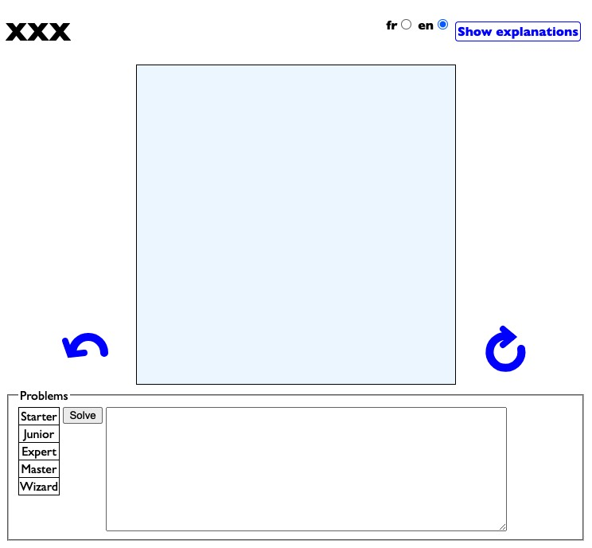
</figure>

Template stub files are provided for game *Pieces*, *Boards*, *Displays* and the necessary JavaScript code for changing the user interface language between French and English and for showing and hiding the explanations\. Of course, these templates can be changed, but they help in keeping uniformity between the games.

## Steps for Building a New Game

We now describe the steps we have found useful in order to adapt a game to this framework.

1. As these types of games come with a set of cards categorized by their level of difficulty, we must first find a way to encode the initial configuration in a machine\-readable format, as we discussed in [Section 2.2](#definition-of-configurations). This format is designed to be similar to the content of the game card and thus faster and easier to input. This input process is relatively cumbersome, explaining why many of our games still do not show initial configurations for all cards. 
2. As the input chosen for the input does not necessarily capture all possible states, especially when pieces can change during the game, e.g., in *Titanic*, boats can board shipwrecked people, in *Squirrel Go Nuts*, pieces can lose their nuts\. In *TipOver* a piece changes its form once it is tipped. The initial configuration must be transformed into a format for both the initial state and the possible transformations of the piece. This process was described in [Section 2.3](#conversion-from-a-problem-to-a-starting-state). 
3. It also proved to be very convenient to already develop a `toString()` for the `Board` class that outputs a human readable representation of the grid corresponding to the current state. This is very useful for checking the effects of board modifications after the play of a jump.
4. Given a state, develop a method to determine if it is a *winning* state.
5. Find a representation for jumps and compute the allowed ones at a given state, see [Section 2.4](#possible-jumps-for-each-piece)
6. Implement the state changes according to a jump.
7. Test solving from starting states using the solver describes in [Section 2.5](#Exploring-States) in batch mode.
8. Embed this algorithm in the Graphical User Interface: first develop SVG representations for the board and the pieces. Move representation must be developed: this often correspond to the positioning of arrows to the pieces that can move. In *placing* games such as *Flip It*, *City Maze* or *Hot Spot*, a drag-and-drop of pieces must be implemented.
9. Implement *undo* of a jump: in some cases it is only a matter of playing the jump inverting the source and target, but when pieces can change the form, this process is more involved because the original form must be restored.

# Conclusion

This document described how to program a unified user interface for single\-player piece placement and sliding games in some detail\. Although all games share many characteristics, each presents its own challenges regarding the board display and modification of the game state based on moves\.

The current screen layout was designed with a computer screen and mouse in mind\. While it can be used on a phone or tablet, the display is less user\-friendly\. Further development is needed in this area\.

# Links for playing on the web and to the source code

|                                                              | Play                                                         | Source code                             |
| ------------------------------------------------------------ | ------------------------------------------------------------ | --------------------------------------- |
|                                                              |                                                              | [Template](./Template)                  |
|      | [Anti-Virus](AntiVirus/AntiVirus.html)                       | [Anti-Virus](./AntiVirus)               |
|  | [Asteroid Escape](AsteroidEscape/AsteroidEscape.html)        | [Asteroid Escape](./AsteroidEscape)     |
|         | [Bend it](BendIt/BendIt.html)                                | [Bend It](./BendIt)                     |
|  | [Cannibal Monsters](CannibalMonsters/CannibalMonsters.html)  | [Cannibal Monsters](./CannibalMonsters) |
|     | [Cats & Boxes](CatsNBoxes/CatsNBoxes.html)                   | [CatsNBoxes](./CatsNBoxes)              |
|       | CityMaze : [Express Delivery](CityMaze/CityMaze_Express_Delivery.html), [On the Double](CityMaze/CityMaze_On_the_Double.html) | [City Maze](./CityMaze)                 |
|         | [Flip It](FlipIt/FlipIt.html)                                | [Flip It](./FlipIt)                     |
|  | [Graveyard Shift](GraveYardShift/GraveYardShift.html)        | [Graveyard Shift](./GraveYardShift)     |
|   | [Grizzly Gears](GrizzlyGears/GrizzlyGears.html)              | [Grizzly Gears](./GrizzlyGears)         |
|        | [Hot Spot](HotSpot/HotSpot.html)                             | [Hot Spot](./HotSpot)                   |
|         | [Jump In](JumpIn/JumpIn.html)                                | [Jump in](./JUmpIn)                     |
|      | [Laser Maze](laserMaze/LaserMaze.html)                       | [Laser Maze](./LaserMaze)               |
|  | [River Crossing](RiverCrossing/RiverCrossing.html)           | [River Crossing](./RiverCrossing)       |
|       | [Rush Hour](RushHour/RushHour.html)                          | [Rush Hour](./RushHour)                 |
|    | [Snow Problem](SnowProblem/SnowProblem.html)                 | [Snow Problem](./SnowProblem)           |
|  | [Squirrels Go Nuts](SquirrelsGoNuts/SquirrelsGoNuts.html)    | [Squirrels Go Nuts](./SquirrelsGoNuts)  |
|     | [Temple Trap](TempleTrap/Temple Trap.html)                   | [Temple Trap](./TempleTrap)             |
|           | [Tilt](Tilt/Tilt.html)                                       | [Tilt](./Tilt)                          |
|        | [Tip over](TipOver/TipOver.html)                             | [TiipOver](./TilpOver)                  |
|        | [Titanic](Titanic/Titanic.html)                              | [Titanic](./Titanic)                    |
|   | [Toads and Frogs](ToadsNFrogs/ToadsNFrogs.html)              | [Toads and Frogs](./ToadsNFrogs)        |

